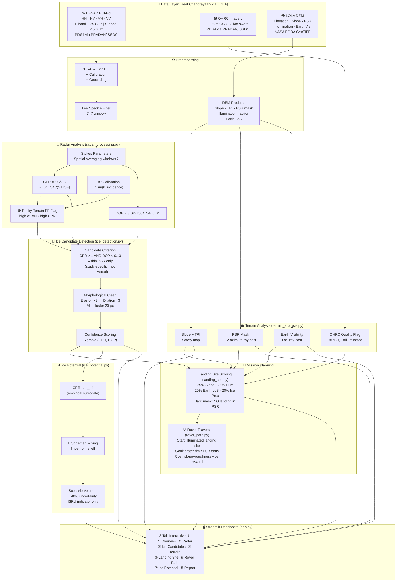
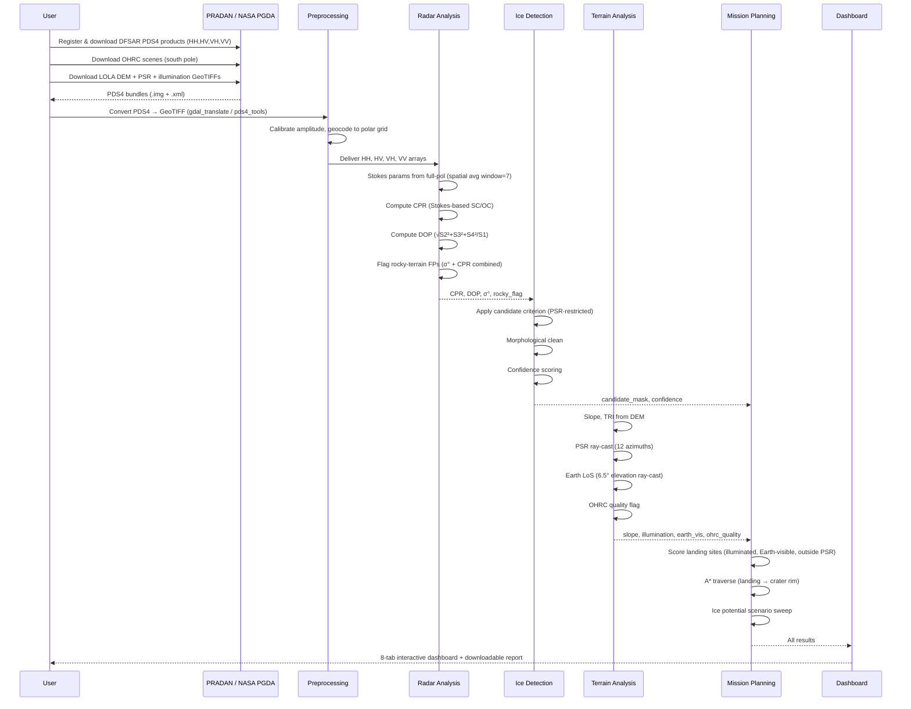

# 🌙 DeepMoon AI — Full System Architecture & Workflow

> **ISRO Hackathon 2025 · Problem Statement 8**  
> Subsurface Ice Detection in Lunar South Polar Regions using Chandrayaan-2 DFSAR

---

## System Architecture Diagram


---

## Data Flow Diagram


---

## 1. Real Data Sources

### 1.1 Chandrayaan-2 DFSAR (Primary Instrument)

| Property | Details |
|----------|---------|
| **Instrument** | Dual Frequency Synthetic Aperture Radar (DFSAR) |
| **Spacecraft** | Chandrayaan-2 Orbiter (~100 km polar orbit) |
| **Frequencies** | **L-band: 1.25 GHz** · **S-band: 2.5 GHz** |
| **Polarimetric Mode** | **Full Polarimetric (FP): HH, HV, VH, VV** — first fully polarimetric SAR on Moon |
| **Resolution** | 2 m to 75 m (configurable slant range) |
| **Incidence Angle** | 9.5° – 35° |
| **Penetration Depth** | L-band: ~3–5 m · S-band: ~1–3 m (ice-bearing regolith) |
| **Data Format** | **PDS4** standard (`.img` data + `.xml` label) |
| **Access Portal** | [pradan.issdc.gov.in](https://pradan.issdc.gov.in) (ISRO PRADAN/ISSDC) |
| **Registration** | Required (free account; approval may take 1–2 days) |
| **Product Level** | Level-1 SLC (Single Look Complex) for full polarimetry |
| **Acknowledgment** | *"We acknowledge use of data from Chandrayaan-2, ISRO, archived at ISSDC."* |

**How to download DFSAR data:**
1. Register at [pradan.issdc.gov.in](https://pradan.issdc.gov.in)
2. Login → Chandrayaan-2 → DFSAR payload
3. Use **CH2 Map Browse** → navigate to lunar south pole (80°S–90°S)
4. Filter by `CH2_DFSAR_*` products, select full-pol mode
5. Use **Bulk Download** for multiple orbits

> [!IMPORTANT]
> DFSAR science-grade data for the subsurface ice paper used full-polarimetric mode.
> Hybrid-pol products are also available but provide less discriminating power for the CPR+DOP criterion.

---

### 1.2 Chandrayaan-2 OHRC (Surface Imagery)

| Property | Details |
|----------|---------|
| **Instrument** | Orbiter High Resolution Camera (OHRC) |
| **Resolution** | **~0.25 m GSD at nadir** |
| **Swath** | 3 km at 100 km altitude |
| **Bands** | Panchromatic |
| **Format** | PDS4 |
| **Access** | [pradan.issdc.gov.in](https://pradan.issdc.gov.in) → `CH2_OHR_Calibrated_Product` |
| **Best use** | Crater morphology, visible boulders, rim features, lobate ejecta |

> [!WARNING]
> OHRC is severely limited inside **deep PSRs** — no direct solar illumination means very low
> signal. OHRC-derived hazard maps are only reliable on **illuminated terrain** (crater rims,
> adjacent plains). The pipeline applies an `ohrc_quality_flag` accordingly.

---

### 1.3 LOLA DEM + Illumination (Terrain Reference)

| Property | Details |
|----------|---------|
| **Instrument** | Lunar Orbiter Laser Altimeter (LOLA) on NASA LRO |
| **DEM Product** | LDEM (Digital Elevation Model) |
| **Resolution** | 5 m/px (high-res south pole) to 20 m/px (regional) |
| **Derived Products** | LDSM (slope), LPSR (PSR mask), illumination fraction, Earth-visibility |
| **Format** | Cloud-Optimized GeoTIFF (COG) |
| **Primary Download** | [NASA PGDA South Pole Products](https://pgda.gsfc.nasa.gov/products/78) |
| **Backup** | [PDS Lunar ODE](https://ode.rsl.wustl.edu/moon/) |
| **LPI Atlas** | [Lunar South Pole Atlas (LPI)](https://www.lpi.usra.edu/lunar/lunar-south-pole-atlas/) |
| **Coverage** | 80°S to 90°S (full polar caps available) |

> [!TIP]
> The NASA PGDA products directly provide **Earth-visibility maps** and **long-baseline illumination
> fraction** (% of time lit over ~1 year). These are far more reliable than DEM-based ray-cast
> approximations for mission planning — use them when available.

---

### 1.4 Supplementary Data Sources

| Source | Content | URL |
|--------|---------|-----|
| LROC NAC | High-res images of PSR margins | [lroc.sese.asu.edu](https://lroc.sese.asu.edu) |
| Chandrayaan-2 TMC-2 | Terrain Mapping Camera DEM (5 m) | PRADAN → `CH2_TMC2_*` |
| Mini-RF (LRO) | S-band CPR reference for south pole | PDS ODE |
| GRAIL gravity | Subsurface density context | PDS GGN |

---

## 2. Complete System Architecture



---

## 3. Module-by-Module Design

### Module 1: `radar_processing.py`

**Role:** Raw DFSAR ingestion → calibrated polarimetric observables

```
Input:  PDS4 DFSAR products → HH, HV, VH, VV (complex amplitude arrays)
Output: CPR map, DOP map, σ° map, rocky-terrain FP flag
```

**Key functions:**

| Function | Purpose |
|----------|---------|
| `stokes_from_quad_pol(HH, HV, VH, VV)` | Compute S1–S4 + SC/OC with 7×7 spatial averaging |
| `compute_cpr_from_stokes(stokes)` | CPR = SC/OC = (S1−S4)/(S1+S4) |
| `compute_dop_from_stokes(stokes)` | DOP = √(S2²+S3²+S4²)/S1 |
| `compute_sigma_naught(amp, θ)` | σ° (dB) = 10·log₁₀(DN²/sin(θ)) |
| `flag_rough_terrain(cpr, sigma_db)` | Rocky FP: σ° > −8 dB AND CPR > 1 |
| `lee_filter(band, 7)` | Speckle suppression |
| `generate_synthetic_dfsar()` | Demo fallback when real PDS4 unavailable |

**Physics:**
- L-band (1.25 GHz): deeper penetration (3–5 m), better for bulk ice detection
- S-band (2.5 GHz): shallower (1–3 m), higher resolution, used in the primary study
- Volume scattering (ice) → enhances SC → CPR > 1
- Volume scattering (ice) → strong depolarization → DOP → 0

---

### Module 2: `ice_detection.py`

**Role:** Apply the study-specific candidate criterion and score detections

```
Input:  CPR, DOP, σ°, PSR mask, rocky-terrain flag
Output: candidate_mask, cpr_only_mask, confidence map, region stats
```

**The Candidate Criterion (from Chauhan et al., npj Space Exploration 2026):**
```
ice_candidate = (CPR > 1.0)  AND  (DOP < 0.13)  AND  (pixel ∈ PSR)
                                                     AND  NOT rocky_terrain_FP
```

**Discriminator logic:**
| Pixel type | CPR | DOP | Result |
|-----------|-----|-----|--------|
| Ice-bearing subsurface | > 1 | < 0.13 | ✅ Candidate |
| Rough/blocky rocky terrain | > 1 | ≥ 0.13 | 🟠 False positive (flagged) |
| Smooth crater floor | < 1 | any | ❌ Not flagged |
| Outside PSR | any | any | ❌ Excluded |

**Post-processing:**
1. Remove rocky-terrain FPs (high σ° AND high CPR)
2. Morphological erosion ×2 → remove single-pixel speckle
3. Morphological dilation ×3 → restore cluster extent
4. Remove connected components < 20 pixels
5. Sigmoid-weighted confidence scoring

---

### Module 3: `terrain_analysis.py`

**Role:** DEM-derived terrain products for safety and mission planning

```
Input:  LOLA DEM GeoTIFF (or TMC-2 DEM)
Output: slope, TRI, PSR mask, illumination fraction, Earth visibility, OHRC quality flag
```

**Key computations:**

| Product | Method | Data source |
|---------|--------|------------|
| Slope | Gradient of DEM | LOLA/TMC-2 |
| TRI (Terrain Ruggedness Index) | σ of local elevation | LOLA/TMC-2 |
| PSR mask | 12-azimuth ray-cast shadow model | DEM |
| Illumination fraction | 48-azimuth orbit sampling | DEM |
| **Earth visibility** | Ray-cast toward Earth at 6.5° elevation | DEM (approx); use NASA PGDA for precision |
| OHRC quality flag | Illumination fraction threshold | DEM + OHRC coverage |

**Critical design choice — OHRC in shadow:**
- OHRC quality = 1.0 where illumination ≥ 2% (reliable hazard mapping)
- OHRC quality = 0.1 inside PSR (deep shadow, unreliable)
- The pipeline propagates this confidence flag through all OHRC-derived hazard products

---

### Module 4: `landing_site.py`

**Role:** Multi-criteria selection of optimal landing zone on illuminated terrain

```
Input:  slope, TRI, illumination, ice_mask, earth_visibility, psr_mask
Output: per-pixel landing score, top candidates, recommended site
```

**Scoring formula:**
```
score = 0.25 × slope_safety
      + 0.25 × illumination      ← MANDATORY survival criterion
      + 0.20 × earth_visibility  ← Direct communication LoS
      + 0.20 × ice_proximity     ← Rover access to science target
      + 0.10 × roughness_safety
```

**Hard masks applied:**
- Slope > 15° → score = 0 (physically unsafe for touchdown)
- Inside PSR → score = 0 (no solar power for lander survival)
- Illumination < 25% → score = 0 (insufficient power generation)

> [!IMPORTANT]
> The lander is NEVER placed on the crater floor or inside the PSR.
> The crater interior is the **science target** — accessed by rover traverse only.

**Landing uncertainty ellipse:** 150 × 100 m (semi-major × semi-minor axes)

---

### Module 5: `rover_path.py`

**Role:** Terrain-aware A* path planning from landing site to science target

```
Input:  slope, TRI, illumination, ice_mask, start_px (landing), goal_px (crater rim)
Output: path waypoints, length_km, waypoint stats (slope, illumination, ice crossings)
```

**A* cost function per step:**
```
cost(node) = base_step_cost
           + slope_penalty     (∝ slope², ∞ if slope > 20°)
           + roughness_penalty (∝ TRI)
           + shadow_penalty    (energy drain in darkness)
           − ice_reward        (incentive to pass through candidates)
```

**Traverse strategy:**
- Start: recommended landing site (illuminated, flat, Earth-visible)
- Goal: crater rim entry point (closest rim pixel to landing site)
- The path approaches but does not necessarily enter the deep PSR
- Science stops annotated at each ice-candidate pixel crossing

---

### Module 6: `ice_potential.py`

**Role:** Scenario-based relative ISRU resource index (NOT absolute volume)

```
Input:  candidate_mask, cpr_map, pixel_size_m, max_depth_m=5
Output: scenario_volume_m3 ±40%, scenario sweep, mean_ice_fraction, mass estimate
```

**Physical model chain:**
```
CPR → ε_effective (empirical)
ε_effective → f_ice (Bruggeman/Polder-van Santen inversion)
f_ice → skin_depth δ (mixture loss tangent)
V_scenario = Σ [A_px × min(δ, 5m) × f_ice]
```

**Dielectric constants used:**
| Medium | ε' | ε'' | tan(δ) |
|--------|-----|-----|--------|
| Dry regolith | 2.7 | 0.005 | 0.0019 |
| Water ice (cold) | 3.15 | 0.001 | 0.00032 |

**Why this is scenario-based, not absolute:**
- CPR→ε mapping is an empirical surrogate (no calibration data for this exact surface)
- True ice concentration, purity, layering geometry unknown
- Orbital SAR cannot resolve sub-meter ice distribution
- Uncertainty floor ±40% is a **lower bound** — actual uncertainty likely higher
- Chandrayaan-2 paper itself calls this "possible presence" of subsurface ice

---

### Module 7: `visualization.py`

**Role:** Plotly-based rendering for all dashboard panels

| Plot | Description |
|------|------------|
| `plot_dem_3d()` | 3D surface plot of crater DEM |
| `plot_cpr_dop_combined()` | Side-by-side CPR+DOP heatmaps with ice overlay |
| `plot_ice_confidence()` | Confidence map with candidate region annotations |
| `plot_landing_analysis()` | Safety score + candidate ellipses |
| `plot_rover_path()` | Path overlaid on terrain + illumination |
| `plot_illumination_wheel()` | Polar illumination fraction plot |
| `array_to_heatmap()` | Generic Plotly heatmap renderer |

---

### App Orchestrator: `app.py`

**Role:** Streamlit dashboard wiring all modules together

```
Streamlit session flow:
├── Sidebar: resolution, seed, CPR/DOP thresholds, band selector
├── @st.cache_data: load_synthetic_data() → all base products
├── @st.cache_data: run_ice_detection() → candidates + confidence
├── @st.cache_data: run_landing_analysis() → scored sites
├── @st.cache_data: run_path_planning() → A* route
├── @st.cache_data: run_potential_estimation() → scenario volumes
└── 8 tabs: Overview | Radar | Ice Candidates | Terrain |
             Landing Site | Rover Path | Ice Potential | Report
```

---

## 4. End-to-End Workflow



---

## 5. Data Format Notes for Real Data Ingestion

### Reading DFSAR PDS4 in Python

```python
# Requires: pip install pds4-tools rasterio numpy

import pds4_tools
import numpy as np

# Load PDS4 label + data
structures = pds4_tools.read('path/to/dfsar_product.xml')
hh = structures[0].data  # HH complex amplitude
hv = structures[1].data  # HV complex amplitude
vh = structures[2].data  # VH complex amplitude
vv = structures[3].data  # VV complex amplitude

# OR: if already converted to GeoTIFF via GDAL:
import rasterio
with rasterio.open('dfsar_HH.tif') as src:
    HH = src.read(1).astype(np.complex64)
```

### Converting PDS4 → GeoTIFF

```bash
# Using GDAL (after installing gdal with PDS4 support)
gdal_translate -of GTiff input_HH.img output_HH.tif

# For each polarization channel
for pol in HH HV VH VV; do
    gdal_translate -of GTiff CH2_DFSAR_${pol}.img CH2_DFSAR_${pol}.tif
done
```

### Uploading to DeepMoon AI Dashboard

Place the converted GeoTIFFs in the project's `data/uploads/` directory:
```
data/uploads/
├── dfsar_HH.tif       ← calibrated HH amplitude (real)
├── dfsar_HV.tif       ← calibrated HV amplitude (real)
├── dfsar_VH.tif       ← calibrated VH amplitude (real)
├── dfsar_VV.tif       ← calibrated VV amplitude (real)
├── ohrc_scene.tif     ← OHRC panchromatic (optional)
└── lola_dem.tif       ← LOLA DEM (20 m/px or finer)
```

---

## 6. Key Scientific References

| Reference | Relevance |
|-----------|-----------|
| Chauhan et al. (2026), *npj Space Exploration* | Primary: CPR+DOP criterion for doubly-shadowed craters, Chandrayaan-2 DFSAR result; 9 craters analyzed, 4 with strong ice signatures including 1.1 km crater in Faustini |
| Black et al. (2001), *GRL* | CPR anomalies in lunar PSRs, establishing CPR > 1 baseline |
| Campbell et al. (2006) | Dual-pol radar constraints on lunar polar ice |
| Nozette et al. (2001) | Clementine bistatic CPR, SC/OC formalism |
| NASA PGDA Products | Earth visibility and illumination reference maps |
| LPI South Pole Atlas | Slope, PSR, and context layers for landing site planning |
| Polder & van Santen (1946) | Dielectric mixing (Bruggeman) model for ice fractions |
| Ulaby, Moore & Fung (1986) | Microwave Remote Sensing Vol. III — radar fundamentals |

---

## 7. Demo vs Real Data Mode

| Aspect | Demo Mode (default) | Real Data Mode |
|--------|---------------------|----------------|
| DFSAR input | `generate_synthetic_dfsar()` — Rayleigh-distributed synthetic full-pol | PDS4 → GeoTIFF via PRADAN |
| DEM | `generate_synthetic_dem()` — Gaussian crater model | LOLA 5–20 m/px GeoTIFF |
| OHRC | Not used | PDS4 OHRC scene |
| PSR | Ray-cast from synthetic DEM | LOLA LPSR product |
| Earth vis | Ray-cast from synthetic DEM | NASA PGDA Earth-visibility COG |
| CPR/DOP | Synthetic (known ground truth) | Real DFSAR full-pol |
| Output | Fully functional dashboard demonstration | Scientifically valid candidate maps |

> [!NOTE]
> The synthetic demo deliberately embeds a known ice-candidate zone in the crater inner floor
> with elevated HV (high CPR) + low DOP to validate the entire pipeline end-to-end.

---

*DeepMoon AI · Chandrayaan-2 DFSAR Full-Pol · ISRO Hackathon 2025 · PS-8*

